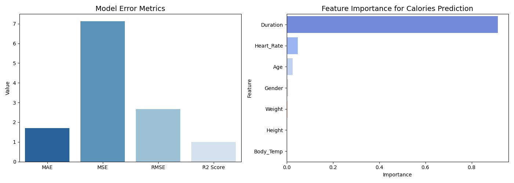

# Calories Burnt Prediction

## Overview

This project predicts calories burned during workouts using a Random Forest Regressor. 

## Dataset
The dataset used for training is from [Calories Burnt Prediction](https://www.kaggle.com/datasets/ruchikakumbhar/calories-burnt-prediction?resource=download)

## Model Training

The dataset is preprocessed by encoding categorical values and standardizing numerical features. A Random Forest Regressor with 100 estimators is trained on the data, providing robust predictions.

## Results

**Error Metrics:**
- MAE: 1.71
- MSE: 7.13
- RMSE: 2.67
- R2 Score: 0.9982 (High accuracy)

**Feature Importance:**
- Duration: 0.91 (Most impactful)
- Heart Rate: 0.048
- Age: 0.026
- Other factors: Gender, Weight, Height, Body Temperature contribute minimally.

 

## Installation & Usage

1. download dataset from [Calories Burnt Prediction](https://www.kaggle.com/datasets/ruchikakumbhar/calories-burnt-prediction?resource=download).
2. Clone the repository and install dependencies.
   
```sh
git clone https://github.com/pathanin-kht/CaloriesBurntPrediction.git
cd CaloriesBurntPrediction
pip install -r requirements.txt
```
4. move .csv file to this folder.
5. Train the model.
```sh
python train_model.py
```

6. Use the trained model to make predictions on new data.

## License
This project is licensed under the [MIT License](LICENSE) - see the LICENSE file for details.

## Contact
For feedback or inquiries, feel free to reach out via [pathanin.kht@gmail.com](pathanin.kht@gmail.com).
